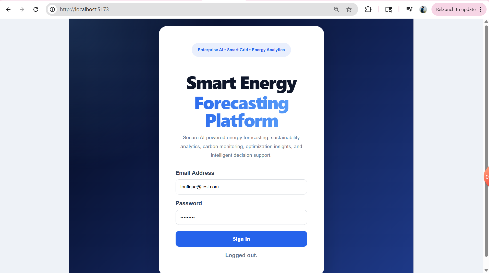
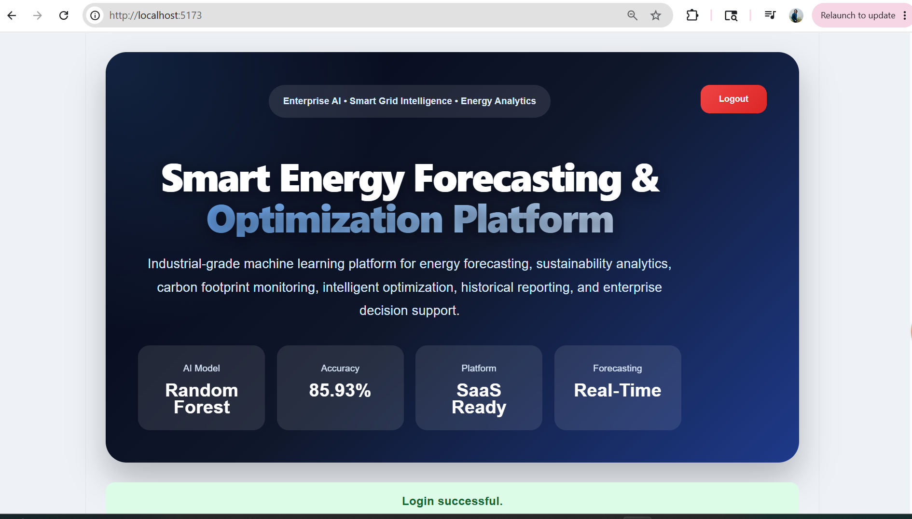
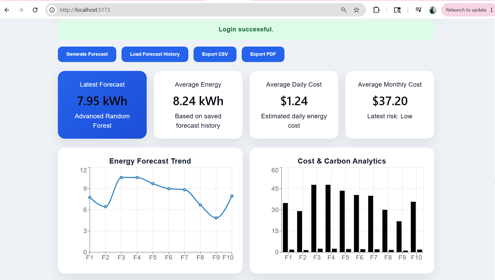
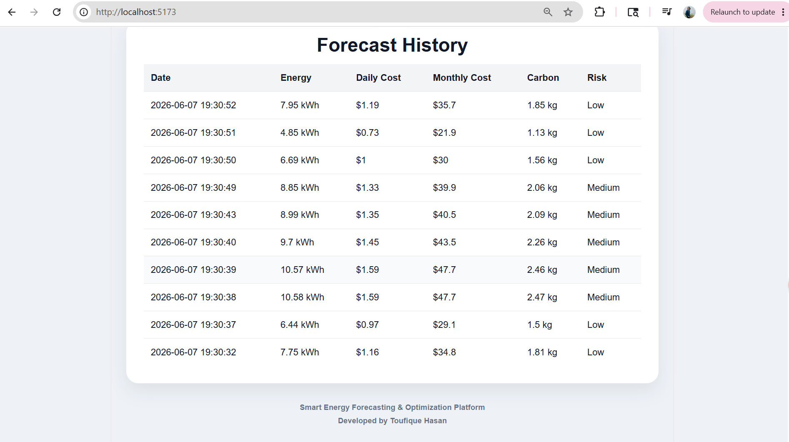
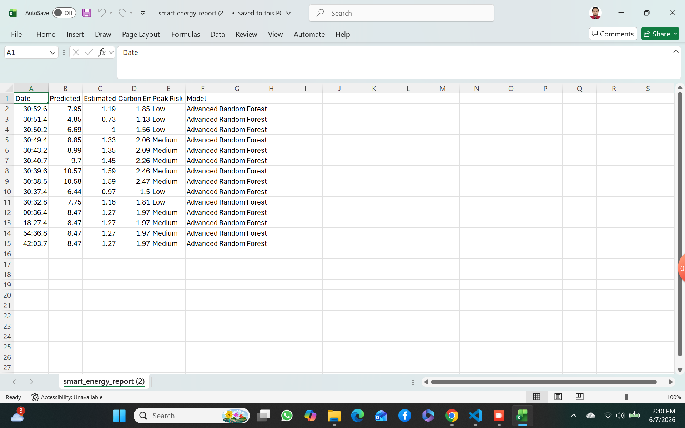
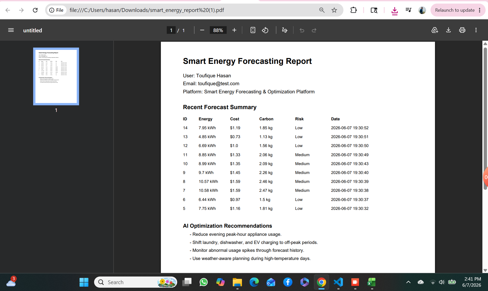

# ⚡ Smart Energy Forecasting & Optimization Platform

An enterprise-grade AI-powered platform for intelligent energy forecasting, sustainability analytics, carbon monitoring, and operational cost optimization.

Built with **React**, **FastAPI**, **Machine Learning**, and **SQLite**, the platform enables organizations to predict energy consumption, estimate costs, analyze carbon emissions, classify energy usage risks, maintain historical forecasts, and generate professional reports.

---

## 🚀 Key Features

### 🔐 Authentication & Security

* JWT-based Authentication
* Secure Login System
* Protected API Endpoints
* Role-Ready Architecture

### 🤖 AI-Powered Energy Forecasting

* Machine Learning-Based Energy Prediction
* Random Forest Forecasting Engine
* Dynamic Forecast Generation
* Intelligent Consumption Analysis

### 📊 Advanced Analytics

* Energy Consumption Forecasting
* Daily Cost Estimation
* Monthly Cost Projection
* Carbon Emission Monitoring
* Energy Risk Classification
* Sustainability Performance Tracking

### 🗄️ Data Management

* SQLite Database Integration
* Historical Forecast Storage
* Forecast Tracking Dashboard
* User Activity Persistence

### 📑 Reporting & Export

* CSV Report Export
* PDF Report Generation
* Forecast History Download
* Analytics Reporting

### 📈 Interactive Visualization

* KPI Monitoring Dashboard
* Energy Trend Analytics
* Cost & Carbon Insights
* Historical Forecast Visualization
* Responsive SaaS-Style Interface

---

## 🛠 Technology Stack

### Frontend

* React
* Vite
* Axios
* Recharts
* CSS3

### Backend

* FastAPI
* SQLAlchemy
* SQLite
* JWT Authentication
* Pydantic

### Machine Learning

* Scikit-Learn
* Random Forest Regressor
* NumPy
* Pandas

### Data Analytics

* Forecasting Models
* Feature Engineering
* Risk Classification
* Cost Optimization Analysis

---

## 🏗 System Architecture

```text
┌─────────────────────┐
│   React Frontend    │
└──────────┬──────────┘
           │
           ▼
┌─────────────────────┐
│   FastAPI Backend   │
└──────────┬──────────┘
           │
           ▼
┌─────────────────────┐
│ Machine Learning AI │
└──────────┬──────────┘
           │
           ▼
┌─────────────────────┐
│  SQLite Database    │
└─────────────────────┘
```

---

## 📸 Platform Screenshots

### Login Interface



### Enterprise Dashboard



### Analytics Dashboard



### Forecast History



### CSV Export Functionality



### PDF Report Generation



---

## 📂 Project Structure

```text
SmartEnergyPlatform/
│
├── backend/
│   ├── app/
│   └── services/
│
├── frontend/
│   ├── src/
│   ├── public/
│   └── assets/
│
├── ml/
│   ├── scripts/
│   └── notebooks/
│
├── screenshots/
│
├── requirements.txt
├── README.md
└── .gitignore
```

---

## ⚙️ Installation

### Clone Repository

```bash
git clone https://github.com/thasan907/SmartEnergyPlatform.git
```

---

### Backend Setup

```bash
cd backend

pip install -r ../requirements.txt

uvicorn app.main:app --reload --host 127.0.0.1 --port 8001
```

---

### Frontend Setup

```bash
cd frontend

npm install

npm run dev
```

Frontend:

```text
http://localhost:5173
```

Backend:

```text
http://localhost:8001
```

---

## 🔌 API Endpoints

### Authentication

```http
POST /auth/login
```

### Energy Forecasting

```http
POST /predict
```

### Forecast History

```http
GET /forecast/history
```

### Export CSV Report

```http
GET /export/csv
```

### Export PDF Report

```http
GET /export/pdf
```

---

## 📋 Sample Forecast Response

```json
{
  "predicted_energy_kwh": 8.45,
  "estimated_cost_usd": 1.27,
  "monthly_cost_usd": 38.10,
  "carbon_emission_kg": 1.96,
  "peak_risk": "Medium"
}
```

---

## 📊 Dataset & Model Files

To maintain a lightweight repository and follow GitHub best practices, large datasets, trained machine learning models, generated reports, and database files are excluded from version control.

Excluded resources include:

```text
data/
ml/models/
*.pkl
*.csv
*.db
*.pdf
*.xlsx
```

Required datasets should be placed inside:

```text
data/raw/
```

Machine learning models can be regenerated using the training scripts located in:

```text
ml/scripts/
```

Example:

```bash
python ml/scripts/03_feature_engineering.py
python ml/scripts/07_train_random_forest_forecast.py
python ml/scripts/09_train_xgboost.py
```

---

## 🌱 Future Enhancements

* Real-Time Smart Meter Integration
* IoT Sensor Connectivity
* Weather-Aware Energy Forecasting
* Deep Learning Forecast Models
* Cloud Deployment (AWS / Azure)
* Multi-Tenant SaaS Architecture
* Real-Time Monitoring Dashboard
* Digital Twin Integration
* Sustainability Intelligence Module

---

## 👨‍💻 Author

**Toufique Hasan**

M.S. Applied Computer Science
Southeast Missouri State University

GitHub:
https://github.com/thasan907

LinkedIn:
https://www.linkedin.com/in/toufique-hasan/

---

## 📜 License

This project is developed for educational, research, portfolio, and professional demonstration purposes.
